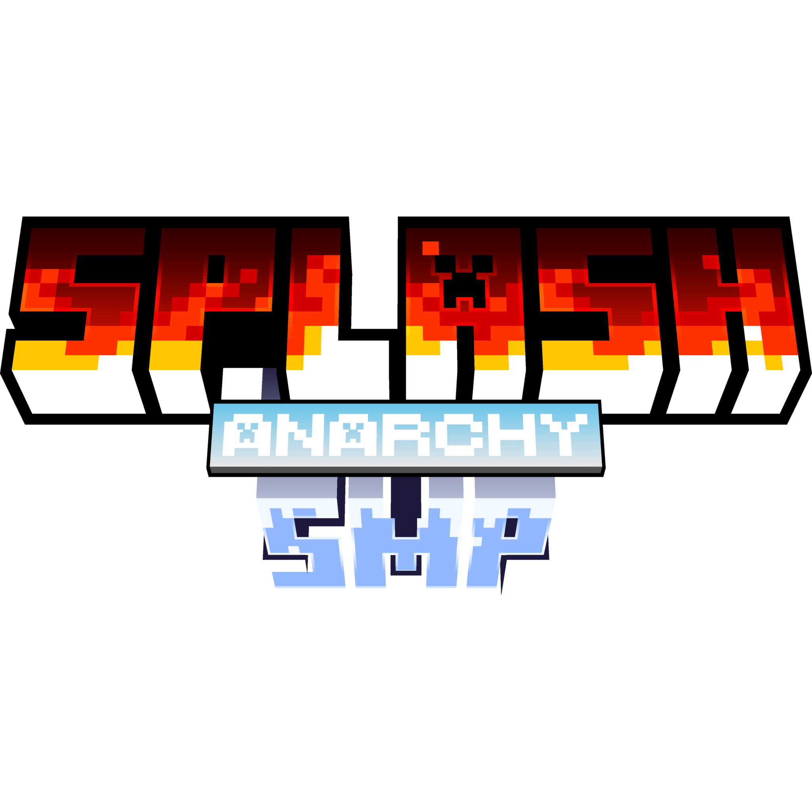

<div align="center">
  

  # SplashSMP – Web

  Oficiální webové stránky serveru **SplashSMP**.
</div>

---

## 🌊 Co je SplashSMP?

SplashSMP je **soukromý Minecraft Roleplay SMP server**, který i s pauzami běží
od roku **2021**. Klade důraz na **RolePlay** (na styl TrospySMP a novějších SMP)
a celkový **lore** serveru.

Server je **whitelistovaný** – přístup získáš po úspěšném absolvování **náboru**
na našem Discordu. Vládne mu prezident a jeho vláda (premiér, soudce, strážci,
armáda…), kteří udržují mír, řeší smlouvy, soudy a eventy. Aktuálně běží
**Season 6** zaměřená primárně na PVP a války, roleplay však zůstává.

Více v sekci **Historie** přímo na webu.

## 📄 Stránky webu

| Stránka | Soubor | Popis |
|---|---|---|
| Domů | `index.html` | Úvodní stránka, info o serveru a připojení |
| Historie | `historie.html` | Časová osa vývoje serveru (2021 – současnost) |
| Členi | `cleni.html` | Přehled členů serveru *(připravuje se)* |
| FAQ & Kontakt | `faq.html` | Často kladené otázky a kontakt |

## 🛠️ Použité technologie

- **HTML5** + **CSS3** (čisté, bez frameworků)
- **JavaScript** (vanilla) – navigace, animace, časová osa
- [Font Awesome](https://fontawesome.com/) – ikony
- Font [Rubik](https://fonts.google.com/specimen/Rubik) (Google Fonts)
- Hostováno na **Vercel** (`vercel.json`)

## 📁 Struktura

```
├── index.html        # Domovská stránka
├── historie.html     # Historie serveru
├── cleni.html        # Členi
├── faq.html          # FAQ & Kontakt
├── style.css         # Sdílené styly (navbar, footer, pozadí…)
├── historie.css      # Styly stránky Historie
├── faq.css           # Styly stránky FAQ
├── cleni.css         # Styly stránky Členi
├── main.js           # Sdílený skript (navigace, animace)
├── historie.js       # Skript časové osy
├── cleni.js          # Skript stránky Členi
└── obrázky (S6_logo.png, image (1).png, …)
```

## 🚀 Spuštění lokálně

Stačí otevřít `index.html` v prohlížeči – web je statický a nevyžaduje žádné
sestavení. Pro správné fungování odkazů (čisté URL) doporučujeme jednoduchý
lokální server:

```bash
# Python
python -m http.server

# nebo Node
npx serve
```

## 🔗 Odkazy

- **Discord:** <https://discord.gg/NAgy2RhSMr>
- **TikTok:** [@splashsmp_](https://www.tiktok.com/@splashsmp_)
- **Instagram:** [@splash.smp](https://www.instagram.com/splash.smp/)
- **YouTube:** [AdasArdaros](https://www.youtube.com/@AdasArdaros/)
- **Kontakt:** splashsmpcontact@gmail.com

---

<div align="center">
  Web vytvořil <strong>Adas</strong> · © SplashSMP 2026
</div>
